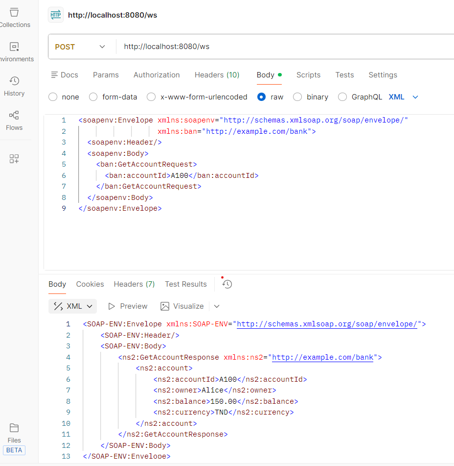
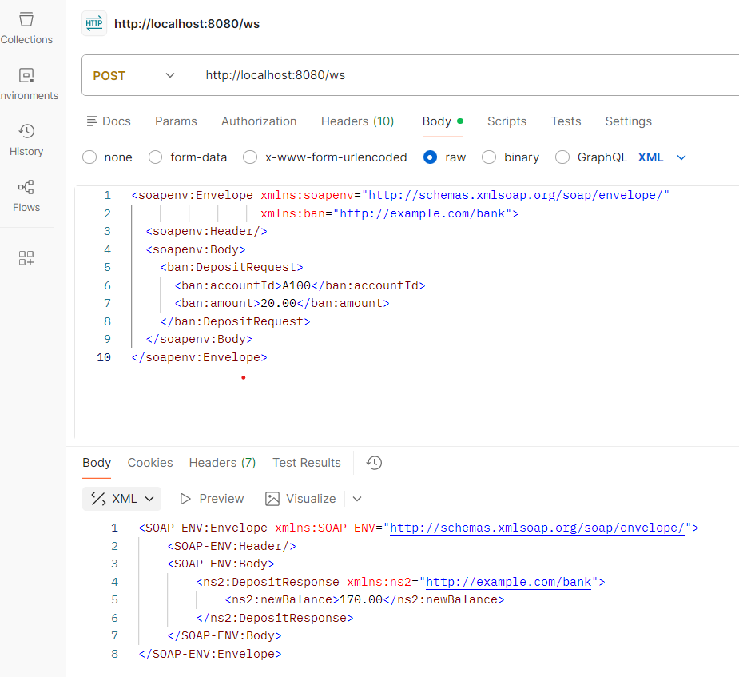
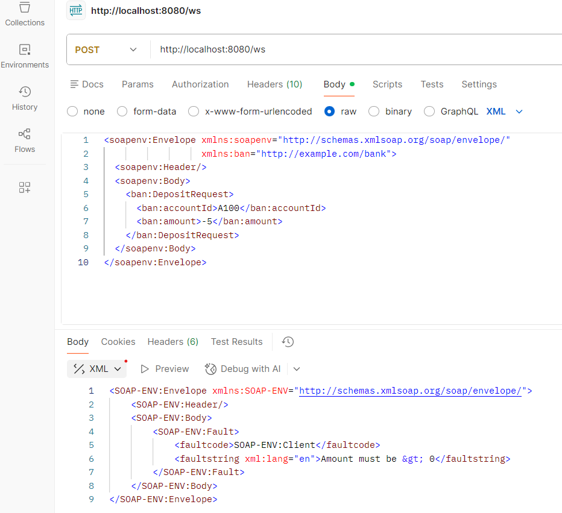
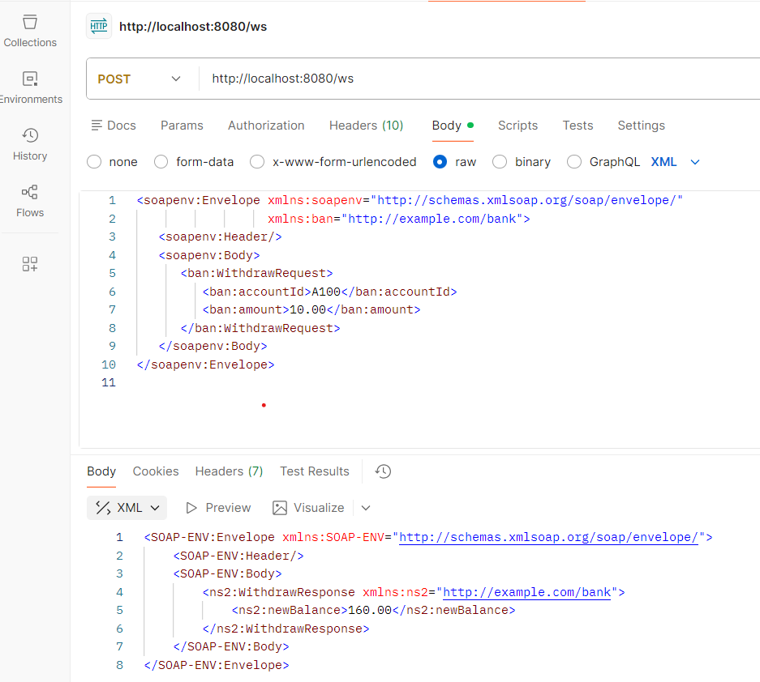
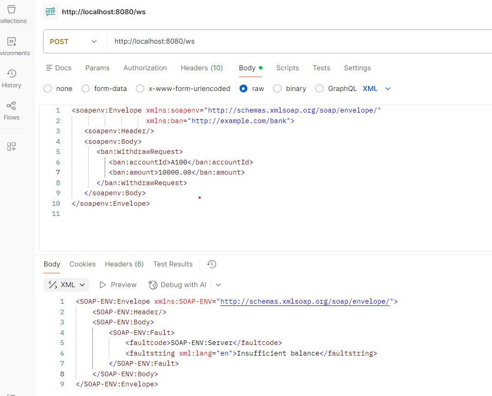

# TP 2.1 – SOA / SOAP avec Spring-WS  
**Réalisé par : Souha Guezguez**

---

# 1️⃣ Mise en place du projet

## 1.1 Fork et Clone

- Fork du dépôt effectué sur GitLab
- Dépôt cloné en local
- Compilation du projet avec :

mvn clean install

- Lancement de l’application avec :

mvn spring-boot:run

---

## 1.2 Vérification du service

- WSDL accessible via :
http://localhost:8080/ws/bank.wsdl

Le service SOAP est correctement exposé et opérationnel.

---

# 2️⃣ Analyse du contrat (Approche Contract-First)

## 2.1 Fichier XSD

- Nom : bank.xsd  
- Emplacement : src/main/resources/bank.xsd  
- Rôle :
  - Définir la structure des messages SOAP
  - Définir les types complexes
  - Valider les données échangées
  - Générer automatiquement les classes Java

---

## 2.2 Types et opérations définis

### Type complexe : AccountType

| Champ      | Type    |
|------------|---------|
| accountId  | string  |
| owner      | string  |
| balance    | decimal |
| currency   | string  |

---

### Opération : GetAccount

- Requête : GetAccountRequest
  - accountId (string)
- Réponse : GetAccountResponse
  - account (AccountType)

---

### Opération : Deposit

- Requête : DepositRequest
  - accountId (string)
  - amount (decimal)
- Réponse : DepositResponse
  - newBalance (decimal)

---

## 2.3 Analyse du WSDL

| Élément     | Valeur |
|------------|--------|
| Namespace  | http://example.com/bank |
| PortType   | BankPort |
| Binding    | SOAP 1.1 – Document/Literal |
| Endpoint   | http://localhost:8080/ws |

---

# 3️⃣ Tests Postman – Opérations existantes

## 3.1 GetAccount – Succès

- Compte testé : A100  
- Statut HTTP : 200 OK  
- Solde retourné : 150.00 TND  

Capture :  

---

## 3.2 Deposit – Succès

- Compte : A100  
- Montant déposé : 20.00 TND  
- Nouveau solde : 170.00 TND  
- Statut HTTP : 200 OK  

Capture :  

---

## 3.3 SOAP Fault – Compte inexistant

- Compte testé : INEXISTANT  
- Statut HTTP : 500 Internal Server Error  
- Message SOAP Fault : "Amount must be > 0"  

Capture :  

---

# 4️⃣ Extension du service – Ajout de Withdraw

## 4.1 Description de la fonctionnalité

Ajout d’une nouvelle opération :

Withdraw : permet de retirer un montant depuis un compte existant.

Cette opération a été implémentée en respectant l’approche contract-first :
1. Modification du fichier XSD
2. Génération des classes
3. Implémentation côté service
4. Exposition via Endpoint SOAP

---

## 4.2 Fichiers modifiés

- bank.xsd – Ajout de WithdrawRequest et WithdrawResponse
- BankService.java – Implémentation de la méthode withdraw()
- BankEndpoint.java – Mapping SOAP pour Withdraw
- InsufficientBalanceException.java – Exception métier personnalisée

---

# 5️⃣ Tests Postman – Withdraw

## 5.1 Cas nominal – Retrait valide

- Compte : A100  
- Montant retiré : 10.00 TND  
- Solde initial : 170.00  
- Nouveau solde : 160.00  
- Statut HTTP : 200 OK  

Capture :  

---

## 5.2 Cas erreur – Solde insuffisant

- Montant demandé : 200.00 TND  
- Statut HTTP : 500 Internal Server Error  
- Message SOAP Fault : "Insufficient balance"  

Capture :  

---

# 6️⃣ Liste des captures incluses

- captures_soa/GetAccount.png  
- captures_soa/Deposit.png  
- captures_soa/Fault.png  
- captures_soa/withdraw.png  
- captures_soa/erreur_withdraw.png  

# Conclusion

Le service SOAP a été :

- Déployé avec succès
- Analysé via son contrat XSD et WSDL
- Testé avec Postman (cas nominal + erreurs)
- Étendu avec une nouvelle opération Withdraw

L’approche contract-first garantit la cohérence entre le contrat XML et l’implémentation Java.
